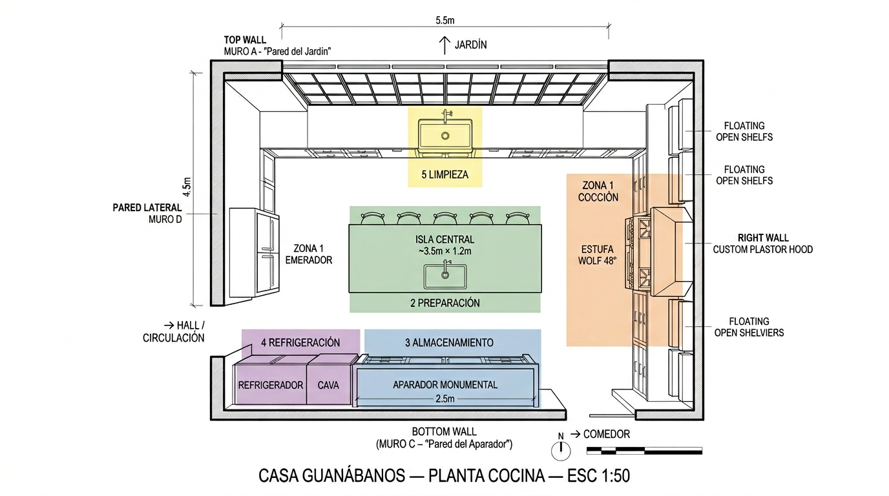
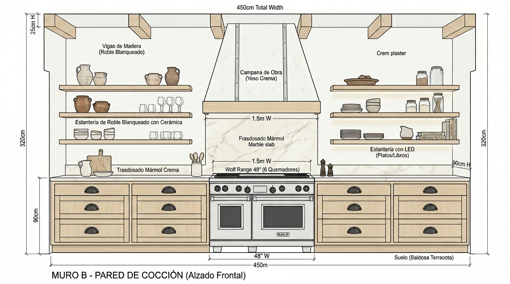
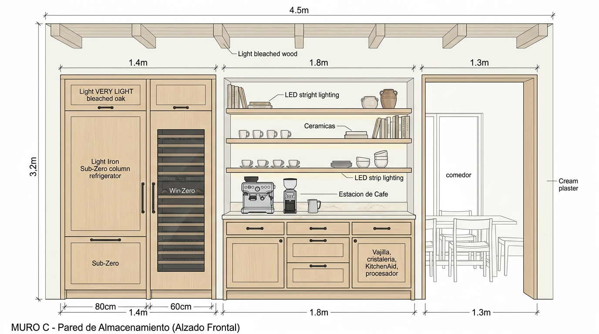
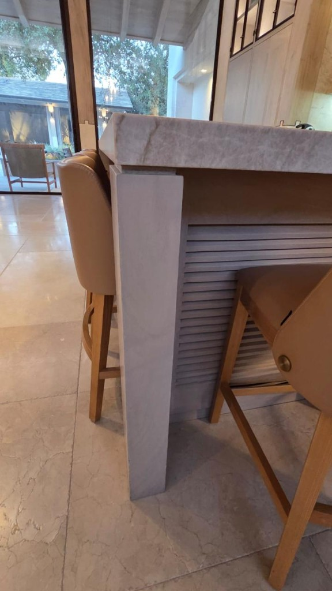
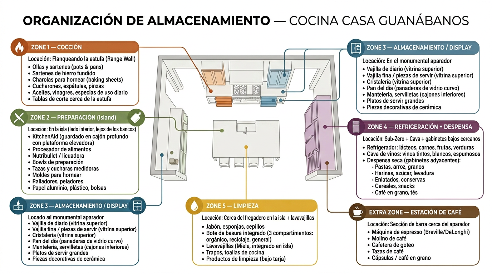
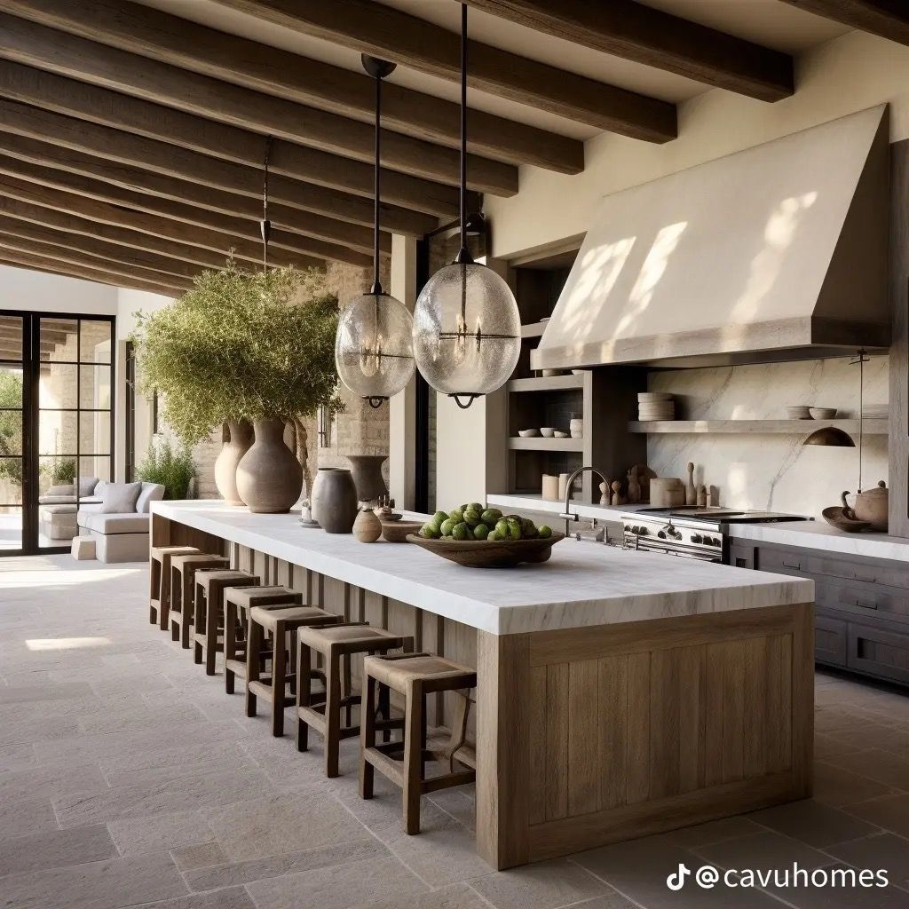
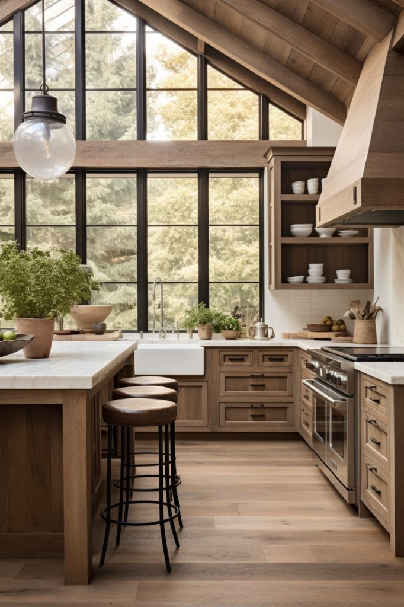
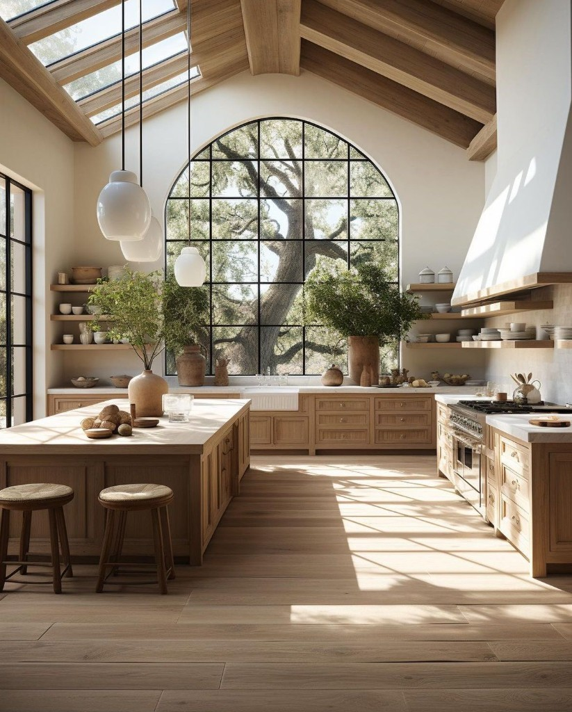

# Casa Guanábanos — Especificación Detallada de Cocina

> **Estilo**: Hacienda contemporánea — roble blanqueado + mármol crema + estuco + hierro negro
> **Arquitecto**: Artigas Arquitectos
> **Superficie estimada**: ~25 m² (5.5m × 4.5m; la dimensión de **4.5 m** era la referencia previa del muro de cocción — ahora **Muro B = 5.0 m** de carrera de mueble para integrar refri + estufa).
> **Altura libre**: 3.20m (plafón de vigas expuestas)

---

## 1. Planta (Vista Aérea)



### Distribución por Zonas

| Zona | Color | Ubicación | Función |
|------|-------|-----------|---------|
| 1 — Cocción + frío | Naranja | Muro B (pared de cocción, **5.0 m**) | **Sub-Zero** French door 49", estufa **Wolf** 48", campana, almacén de cocina |
| 2 — Preparación | Verde | Isla central | Prep, corte, mezcla (sin tarja — cubierta libre) |
| 3 — Almacenamiento | Azul | Muro C (pared de almacenamiento) | Vajilla, cristalería, aparatos, café |
| 4 — Refrigeración | Morado | **Muro B** (integrado con cocción) | **Sub-Zero** French door 49"; cava sigue **por definir** (bar / otro muro) |
| 5 — Limpieza | Amarillo | Muro C (módulo tarja) | Tarja farmhouse moderna, lavavajillas, basura |
| 6 — Café | Café | Muro C (centro) | Espresso, molino, cafetera |

### Triángulo de Trabajo

```
  REFRIGERADOR (Muro B, junto a estufa)
           |
           |  ~2.0–3.0m (según geometría isla / Muro C)
           |
  TARJA (Muro C) ———————— ESTUFA (Muro B)
        ~2.0m                      ~2.5m
```

Perímetro del triángulo: **refri y estufa comparten Muro B**; distancia refri–tarja depende del plano. Objetivo **4–8 m** de perímetro entre los tres puntos.

---

## 2. Alzados (Vistas Frontales)

### Muro A — Pared del Jardín (ventanal)
- Ventanal de piso a techo en **herrería negra estilo grid** (tipo steel-frame)
- Vista directa al jardín — luz natural inundando la cocina
- Opcional: sección baja de gabinetes con tarja secundaria de preparación bajo la ventana
- **Sin gabinetes superiores** — la vista al jardín es el protagonista

### Muro B — Pared de Cocción + Refrigeración integrada

**Carrera total de mueble (cubierta inferior): 5.0 m** — cabe **Sub-Zero French door 49"** + **Wolf 48"** + ala de gabinetes/repisas a cada lado, con holguras de instalación. Distribución de referencia (izquierda → derecha, **invertible** según croquis del arquitecto):

```
[ Ala ~1.22 m ] + [ Sub-Zero 49" ~1.245 m ] + [ filler ~0.08 m ] + [ Wolf 48" ~1.22 m ] + [ Ala ~1.23 m ]  ≈  5.00 m
```

> **Nota:** Cifras de vano son **shop-drawing**; confirmar con hoja de corte Sub-Zero del modelo exacto (49" nominal) y nicho Wolf. El render `cocina-muro-coccion.png` no refleja el refri en este muro.



| Elemento | Especificación | Precio Estimado |
|----------|---------------|-----------------|
| **Sub-Zero French door 49"** | Integrado entre paneles de roble blanqueado; modelo a confirmar en catálogo actual (línea built-in / Pro). Toma de agua si aplica hielo / dispensador. | $400,000–650,000 (equipo + paneles — validar con distribuidor) |
| **Wolf 48" Dual Fuel** | **DF48650/S** — centro del módulo de cocción; alineado a cubierta y zócalo | (ver electrodomésticos) |
| **Filler térmico / junta** | Sep. **~8 cm** entre mueble de refri y mueble de estufa (ajustable); acabado a juego | Incluido en carpintería |
| **Gabinetes inferiores** (×2 alas, **~2.45 m** total) | Roble blanqueado, cajones Blum Tandembox, frentes shaker — **ala izquierda ~1.22 m** + **ala derecha ~1.23 m** | $95,000–145,000 |
| **Herrajes** | Bin-pulls hierro forjado negro (RK International / Tonalá) | $14,000–22,000 |
| **Repisas flotantes** (×6, 3 por ala) | Roble macizo, 30 cm fondo, **~55–65 cm** largo por repisa (encajan en alas ~1.22–1.23 m), LED Häfele Loox 2700K | $38,000–58,000 |
| **Salpicadera** | **Mármol Crema Marfil** detrás de **Wolf**: losa continua del counter a campana **~1.5 m × ~1.5 m**; tras **Sub-Zero**: panel a juego o acero según ficha de integración | $42,000–68,000 |
| **Campana** | Estuco/yeso sobre estructura metálica, centrada sobre **48"** Wolf; inserto **Faber** o **Vent-A-Hood** 1200 CFM | $45,000–75,000 |
| **Cubierta Muro B** | Mármol Crema Marfil 3 cm, **corrido ~5.0 m** | $42,000–68,000 |

### Muro C — Pared de Almacenamiento + Limpieza



> **Nota:** El render `cocina-muro-almacen.png` aún muestra columnas de frío; el diseño actual **no** incluye refrigerador ni cava en este muro — sustituidos por tarja + lavavajillas.

| Elemento | Especificación | Precio Estimado |
|----------|---------------|-----------------|
| **Módulo tarja** (~90cm) | Gabinete bajo roble blanqueado; **tarja farmhouse moderna** (delantera plana, líneas limpias): **Kohler Whitehaven** K-6489 (fireclay ~84cm) o **Blanco IKON** 401900 (Silgranit, apron recto). Salpicadero continuo **mármol Crema Marfil** en zona húmeda. | $22,000–40,000 (tarja) + $28,000–45,000 (mueble + instalación) |
| **Grifería** | **Brizo Litze** bridge con spray extraíble, o **Delta Emmeline** en negro mate / latón cepillado — perfil más contemporáneo que bridge victoriano | $18,000–35,000 |
| **Lavavajillas** (60cm) | **Miele** G 7566 SCVi totalmente integrado, panel roble blanqueado, **inmediato a la tarja** | $42,000–55,000 (ver electrodomésticos) |
| **Basura integrada** | **Häfele** o **Rev-A-Shelf** triple (orgánico / reciclaje / general), cajón bajo cubierta junto al lavavajillas | $8,000–12,000 |
| **Gabinetes inferiores centro** (~1.8m) | Roble blanqueado, cajones profundos (para KitchenAid, procesador, Nutribullet) + puertas con entrepaños | $60,000–90,000 |
| **Cubierta centro** | Mármol Crema Marfil, 3cm, corrido desde módulo tarja | $18,000–30,000 |
| **Repisas flotantes** (×3) | Roble blanqueado con LED strip Häfele Loox debajo de cada una | $18,000–27,000 |
| **Estación de café** | Espacio dedicado sobre cubierta: enchufe oculto detrás para espresso + molino | Incluido en eléctrica |

### Isla Central



| Elemento | Especificación | Precio Estimado |
|----------|---------------|-----------------|
| **Estructura isla** (3.5m × 1.2m) | Base de roble blanqueado con paneles verticales tipo wainscoting, estructura interior de MDF/triplay | $90,000–140,000 |
| **Cubierta isla waterfall** | **Mármol Crema Marfil**, 8cm espesor, con cascada (waterfall) en un extremo. Losa seleccionada por veta. ~4.5 m² total. **Sin perforación para tarja** — superficie continua para prep y servicio. | $140,000–220,000 |
| **Bancos** (×5) | Artesanales: madera clara (fresno o encino blanqueado) + asiento tejido de palma/enea, sin respaldo | $5,000–8,000 c/u = $25,000–40,000 |
| **Pendientes** (×3) | Cerámica artesanal blanca, forma orgánica/escultórica (**Nouvel Studio** CDMX o **Ceramic Series** de Entler Studio), cordón negro | $15,000–30,000 c/u = $45,000–90,000 |

> **Nota:** El render `cocina-isla.png` puede mostrar tarja; el diseño actual concentra **tarja + lavavajillas en Muro C**.

---

## 3. Electrodomésticos — Especificación Completa

| # | Electrodoméstico | Marca / Modelo Recomendado | Ubicación | Precio Est. |
|---|-----------------|---------------------------|-----------|-------------|
| 1 | **Range (estufa + horno)** | **Wolf** DF48650/S — 48" Dual Fuel, 6 quemadores + griddle, 2 hornos, acero inoxidable | Muro B — módulo cocción (~1.22 m vano) | $180,000–220,000 |
| 2 | **Extractor** (oculto en campana de estuco) | **Vent-A-Hood** BH234SLD o **Faber** Inca Smart — 1200 CFM, liner insert oculto | Dentro de campana custom Muro B | $25,000–45,000 |
| 3 | **Refrigerador** | **Sub-Zero** French door **49"** built-in — integrado con paneles; **confirmar número de modelo** en showroom | Muro B — al lado del Wolf (ver diagrama 5.0 m) | $400,000–650,000 |
| 4 | **Cava de vinos** | *Por definir* — columna, bajo cubierta en bar, o pie independiente (ej. EuroCave) | Fuera de Muro C | (línea aparte) |
| 5 | **Lavavajillas** | **Miele** G 7566 SCVi — totalmente integrado, AutoDos, panel roble | Muro C — junto a tarja | $42,000–55,000 |
| 6 | **Microondas** (opcional) | **Wolf** cajón microondas MDD30 — empotrado en isla o Muro C | Cajón en isla (lado interior) | $28,000–38,000 |
| 7 | **Máquina de espresso** | **Breville** Barista Express o **De'Longhi** La Specialista | Muro C — estación de café (sobre cubierta) | $12,000–25,000 |
| 8 | **Molino de café** | **Baratza** Encore ESP o **Breville** Smart Grinder Pro | Muro C — junto a espresso | $5,000–8,000 |

### Total electrodomésticos en cocina: **$664,000 – 1,041,000** (incluye Sub-Zero en Muro B; sin cava)  
*Cava: línea aparte. Precio Sub-Zero: validar con **Sub-Zero & Wolf México**.*

---

## 4. Organización de Almacenamiento



### Detalle por Zona

#### ZONA 1 — COCCIÓN + FRÍO (Muro B — 5.0 m: ala + Sub-Zero + Wolf + ala)

Orden de referencia: **ala A** (un extremo) — **Sub-Zero 49"** — **Wolf 48"** — **ala B** (otro extremo). Si el croquis invierte el orden, renombrar A/B.

| Ubicación | Contenido | Tipo de almacenamiento |
|-----------|-----------|----------------------|
| **Sub-Zero 49"** (vano integrado) | Refrigeración fresca + congelación (según modelo) | Interior de equipo |
| **Wolf 48"** | Cocción / hornos | — |
| Cajones ala **A** #1–3 | Ollas, sartenes, charolas de horno (distribuir según lado del refri o de la estufa) | Cajones profundos + divisores |
| Repisas ala **A** ×3 | Display vajilla / decoración | Repisas ~55–65 cm |
| Cajones ala **B** #1–3 | Utensilios, aceites/especias diarias, tablas y textiles | Cajones con insertos |
| Repisas ala **B** ×3 | Servir, libros de cocina, tazas | Repisas ~55–65 cm |

#### ZONA 2 — PREPARACIÓN (Isla — lado interior, opuesto a bancos)

| Ubicación | Contenido | Tipo de almacenamiento |
|-----------|-----------|----------------------|
| Cajón isla #1 (grande, profundo) | **KitchenAid** batidora de pie — con plataforma elevadora de resorte | Cajón con mecanismo elevador Rev-A-Shelf |
| Cajón isla #2 (grande) | **Procesador de alimentos** (Cuisinart) + **Nutribullet** + licuadora | Cajón profundo con divisores |
| Cajón isla #3 | Bowls de preparación (set de acero inoxidable anidados) | Cajón estándar |
| Cajón isla #4 | Tazas y cucharas medidoras, ralladores, peladores, mandolina | Cajón con inserto organizador |
| Cajón isla #5 | Moldes para hornear, cortadores, rodillo, tapete silicón | Cajón profundo |
| Cajón isla #6 | Papel aluminio, plástico adherente, bolsas resellables, papel encerado | Cajón con cortador integrado (Häfele) |
| Puerta isla #1 | Electrodoméstico menor, despensa seca compacta, o cajón extra de prep | A criterio — la **basura triple** pasó a **Muro C** (módulo limpieza) |

#### ZONA 3 — ALMACENAMIENTO + DISPLAY (Muro C — repisas y gabinetes centro)

| Ubicación | Contenido | Tipo de almacenamiento |
|-----------|-----------|----------------------|
| Repisa Muro C #1 (superior) | Piezas decorativas de cerámica, jarrones, arte | Display decorativo |
| Repisa Muro C #2 (media) | Vajilla fina / piezas de servir especiales, libros de cocina | Display + uso |
| Repisa Muro C #3 (inferior) | Tazas de café, French press, tetera | Display accesible (junto a café) |
| Gabinete Muro C #1 | Vajilla de diario (platos, bowls, tazones) — sets completos | Entrepaños ajustables |
| Gabinete Muro C #2 | Cristalería (copas de vino, vasos, copas champagne) | Entrepaños ajustables |
| Gabinete Muro C #3 (cajones) | Mantelería: manteles individuales, servilletas de tela, caminos de mesa | Cajones poco profundos |

#### ZONA 4 — DESPENSA SECA + CAVA (frío principal en Muro B)

| Ubicación | Contenido | Tipo de almacenamiento |
|-----------|-----------|----------------------|
| **Refrigerador** | **Sub-Zero** French 49" en **Muro B** | Interior equipo |
| **Cava** (ubicación TBD) | Vinos por temperatura | Columna, bajo cubierta en bar, o pie |
| Gabinete bajo Muro C o alacena | **Despensa seca**: pastas, arroz, granos, harinas, azúcar (OXO Pop) | Entrepaños + contenedores |
| Gabinete / entrepaño adyacente | Enlatados, conservas, miel, mermeladas, cereales | Entrepaños ajustables |
| Cerca de estación de café | Café en grano, tés, cápsulas, endulzantes | Cajón o tarro |

#### ZONA 5 — LIMPIEZA (Muro C — módulo tarja + lavavajillas)

| Ubicación | Contenido | Tipo de almacenamiento |
|-----------|-----------|----------------------|
| Bajo tarja | Jabón, esponja, cepillo; productos de limpieza frecuente | Organizador de puerta Rev-A-Shelf + entrepaño |
| Junto a tarja | **Lavavajillas Miele** integrado | Panel custom roble blanqueado |
| Junto a lavavajillas | **Basura triple** (orgánico / reciclaje / general) | Cajón Rev-A-Shelf / Häfele |
| Gabinete lateral (opcional) | Trapos, toallas de cocina, repuestos | Cajón o barra interior |

#### ZONA 6 — ESTACIÓN DE CAFÉ (Muro C — centro de cubierta)

| Ubicación | Contenido | Nota |
|-----------|-----------|------|
| Sobre cubierta | Máquina de espresso + molino de café | Enchufes ocultos detrás (2 contactos dobles dedicados) |
| Repisa inferior (accesible) | Tazas de café, French press, tetera | A la mano |
| Cajón inferior | Café en grano (bolsas), filtros, cápsulas, tés | Cajón con divisores |

---

## 5. Plafón — Celosía / Vigas

| Elemento | Especificación | Precio Estimado |
|----------|---------------|-----------------|
| Tipo | **Vigas expuestas de roble blanqueado** con entablado entre vigas — acabado wash de cal diluida | |
| Vigas | Roble o encino, sección ~20×25cm, acabado blanqueado mate | |
| Entablado | Tablas de cedro o pino entre vigas, acabado blanqueado igual | |
| Iluminación empotrada | 6–8 spots empotrados **WAC Lighting** 2" round, 2700K, en las vigas | $18,000–24,000 |
| **Total plafón cocina** (~25 m²) | Carpintería artesanal — maestro carpintero | **$250,000–450,000** |

---

## 6. Piso

| Elemento | Especificación | Precio Estimado |
|----------|---------------|-----------------|
| Material | **Mármol Crema Marfil** apomazado (continuidad con áreas sociales PB) o **travertino** claro | |
| Formato | 80×80cm o 60×120cm | |
| Junta | Mínima (2mm), mismo tono | |
| Total (~25 m²) | Crema Marfil apomazado | **$87,500–137,500** |

---

## 7. Ventanería (Muro A — Jardín)

| Elemento | Especificación | Precio Estimado |
|----------|---------------|-----------------|
| Sistema | **Schüco** o herrería artesanal tipo steel-frame, cuadrícula, acabado negro mate | |
| Cristal | Doble bajo emisivo + control solar | |
| Dimensión | ~5.5m ancho × 2.8m alto (piso a vigas) | |
| Tipo | Fijo con secciones operables (abatibles o corredizas) | |
| Total | | **$180,000–280,000** |

---

## 8. Instalaciones MEP Requeridas

### Hidráulica (Plomería)
- Toma de agua fría + caliente + desagüe para **tarja farmhouse en Muro C** (muro de carga — típicamente más simple que isla)
- Toma de agua para lavavajillas (mismo módulo Muro C, junto a tarja)
- Toma de agua para **Sub-Zero** en **Muro B** (si el modelo lleva dispensador / hielos)
- Toma de agua para máquina de café (opcional — línea directa)

### Gas LP
- Tubería encamisada para estufa Wolf 48" — **confirmada en planos MEP**
- Salida de gas con válvula de corte accesible detrás de la estufa
- Capacidad: 120,000 BTU mínimo para el range de 48"

### Eléctrica
- Circuito dedicado 240V/30A para estufa Wolf (horno eléctrico del Dual Fuel)
- Circuito dedicado 120V/20A para **Sub-Zero** (Muro B; ver manual si el modelo exige circuito dedicado mayor)
- Circuito dedicado 120V/20A para lavavajillas Miele (Muro C)
- Circuito dedicado 120V/20A para **cava de vinos** (si aplica en su ubicación)
- 2 contactos dobles para estación de café (detrás, ocultos)
- 4 contactos en isla (2 por lado, retráctiles o pop-up **Häfele** para evitar visual)
- 2 contactos en zona de repisas Muro B (para pequeños electrodomésticos temporales)
- Circuito para extractor de campana
- Circuito para iluminación (LED strips + empotradas + pendientes)
- Pre-cableado para sistema de control **Lutron** RadioRA3 (dimmers en pendientes y LED)

---

## 9. Resumen de Presupuesto — Cocina Completa

| Rubro | Precio Estimado MXN |
|-------|-------------------|
| Gabinetes perimetrales Muro B (5.0 m) + Muro C (roble, Blum, herrajes hierro) | $195,000–295,000 |
| Isla (estructura roble + waterfall Crema Marfil 8cm) | $230,000–360,000 |
| Repisas flotantes con LED (Muro B ×6 + Muro C ×3) | $56,000–85,000 |
| Campana custom estuco + extractor interno | $70,000–120,000 |
| Salpicadera / paneles traseros (Muro B refri + cocción) | $42,000–68,000 |
| Cubiertas mármol perimetrales (incl. Muro B ~5.0 m) | $48,000–78,000 |
| **Electrodomésticos** | |
| — Wolf 48" Dual Fuel | $180,000–220,000 |
| — Sub-Zero French door 49" (Muro B) | $400,000–650,000 |
| — Miele Lavavajillas integrado (Muro C) | $42,000–55,000 |
| — Wolf cajón microondas (opcional) | $28,000–38,000 |
| — Espresso + molino | $17,000–33,000 |
| Tarja farmhouse moderna (Muro C) | $22,000–40,000 |
| Grifería bridge contemporánea (Brizo / Delta) | $18,000–35,000 |
| Bancos artesanales ×5 | $25,000–40,000 |
| Pendientes cerámica artesanal ×3 | $45,000–90,000 |
| Spots empotrados en vigas ×8 | $18,000–24,000 |
| Plafón vigas blanqueadas | $250,000–450,000 |
| Piso Crema Marfil (~25 m²) | $87,500–137,500 |
| Ventanería steel-frame Muro A | $180,000–280,000 |
| Herrajes Häfele (basura, elevador KitchenAid, etc.) | $20,000–35,000 |
| Instalaciones MEP (adicional a obra base) | $40,000–60,000 |

### GRAN TOTAL COCINA

| | MXN | USD |
|--|-----|-----|
| **Rango** | **$2,035,000 – $3,195,000** | **$116,000 – $182,000** |
| **Punto medio recomendado** | **~$2,615,000** | **~$149,000** |

---

## 10. Resumen Visual — Las 4 Paredes

| Vista | Imagen |
|-------|--------|
| Planta (zonas) |  |
| Muro B — Cocción |  |
| Muro C — Almacenamiento |  |
| Isla Central |  |
| Organización |  |

---

## 11. Imágenes de Referencia

| Referencia | Elementos que aplican |
|------------|----------------------|
|  | Isla monumental + campana estuco + repisas abiertas + pendientes vidrio + bancos rush + ventanal steel |
|  | Gabinetes roble + herrajes iron bin-pull + campana madera + tarja farmhouse + techo vigas |
|  | Tono de madera correcto (roble blanqueado) + ventanal arco steel-frame + pendientes cerámica + repisas abiertas |

---

## 12. Proveedores y Talleres Recomendados

| Especialidad | Proveedor | Notas |
|-------------|-----------|-------|
| Carpintería (gabinetes, isla, repisas) | Taller local CDMX con experiencia en roble + Blum | Pedir muestras de acabado blanqueado en roble y encino |
| Mármol (cubiertas, waterfall, salpicadera) | **Mármoles Arca** o **Cosentino** CDMX | Seleccionar losa personalmente por veta |
| Campana de estuco | Albañil + estucador — construida in situ sobre estructura metálica | Coordinar con proveedor de extractor para dimensiones |
| Herrería (herrajes iron) | Talleres de **Tonalá** o **San Miguel de Allende** | Muestras de bin-pulls en negro mate forjado |
| Tarja + grifería | **Kohler** / **Blanco** distribuidores CDMX; grifería **Brizo** / **Delta** | Confirmar medida de vano con tarja elegida |
| Electrodomésticos Wolf + Sub-Zero + Miele | **Sub-Zero & Wolf México** — integración **French 49"** + **Wolf 48"** en **Muro B**; **Miele** lavavajillas | Cava: línea aparte |
| Pendientes cerámica | **Nouvel Studio** (CDMX) o **Entler Studio** (importación) | Pedir muestras de forma y tamaño |
| Bancos artesanales | Carpintero de fresno/encino + artesano de palma (Michoacán) | Prototipo antes de producir los 5 |

---

*Última actualización: 20 de marzo de 2026 — **Muro B 5.0 m:** Sub-Zero French 49" + Wolf 48" + alas de repisas/gabinetes. **Muro C:** tarja farmhouse + lavavajillas.*
